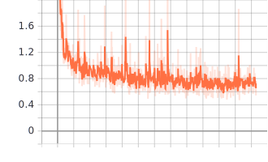

### Project overview
One of the essential tasks in self-driving cars is how to percieve real world via cameras. In this project, Tensorflow object detection API is used. The goal of this project is as follows:
* Explore and visualize image data stored as tf-record.
* Prepare and split data for train and validation.
* Train a base model object detection.
* Train with data augmentation.
* Train with changing different learning rates.
* Monitor training progress.
* Evaluate the training results.
* Export the model for inference.

### Set up
First of all, these experments are done in Udacity workspace. Therefore, the packages used are listed in the requirements.txt file. 
To run the experements, There six components I will explain as follows.

First step: Exploratory Data Analysis.ipynb
* At the beginning, the data were located at data/waymo/training_and_validation
* Running this notebook is strait forward. Just making sure a correct folder path to tf records is set.

Second step: create_splits.py
This script assumes the tf records are stored under 'training_and_validation'  directory. 
To run the code correctly, passing the parent directory of this folder is reqired, i.e.:
python create_splits.py ./data/waymo

Third step:
* Downloading the pretrained model from http://download.tensorflow.org/models/object_detection/tf2/20200711/ssd_resnet50_v1_fpn_640x640_coco17_tpu-8.tar.gz and unzip it to ./experiments/pretrained_model/

* config files: under the folder expirements, three config files generated under experement0, experement1, and experement2

to run the first experement:
```
python experiments/model_main_tf2.py --model_dir=./experiments/experiment0/ --pipeline_config_path=./experiments/experiment0/pipeline_new.config
```
to monitor the first experiment:
```
python -m tensorboard.main --logdir experiments/experiment0/
```
to evaluate the first experiment:
```
python experiments/model_main_tf2.py --model_dir=experiments/experiment0/ --pipeline_config_path=experiments/experiment0/pipeline_new.config --checkpoint_dir=experiments/experiment0/
```

to export the model for inference:
```
python experiments/exporter_main_v2.py --input_type image_tensor --pipeline_config_path experiments/experiment0/pipeline_new.config --trained_checkpoint_dir experiments/experiment0/ --output_directory experiments/experiment0/exported/
```
to run inference for testing:
```
python inference_video.py --labelmap_path label_map.pbtxt --model_path experiments/experiment0/exported/saved_model --tf_record_path ./data/waymo/test/segment-12200383401366682847_2552_140_2572_140_with_camera_labels.tfrecord --config_path experiments/experiment0/pipeline_new.config --output_path animation.gif
```
Due to limited space in the student workspace, models need to be deleted to run different experiments. To delete models files from experiment 0:
```
find ./experiments/experiment0/ -name "ck*" -exec rm {} \;
```


for the other experiments, the number 0 in 'experiment0' needs to be replaced by 1 or 2.


### Dataset
#### Dataset analysis
This data set contains images stored in 97 tf records. There are three classes avaialbe, pedestrians, cars, and cyclists. It has different challenging characterestics that affect the performance. First, class imbalance, the number of cars is way much more than pedestrian and cyclists. Second, outdoor condition like sun, fog, etc makes the data with high variablility. Finally, small objects sizes which makes adverse effect on the performance of object detections.
#### Cross validation
The dataset was split into training and validation sets with a percentage of 80% and 20% respectivly. The reason for that is to use as much training data as possible to reduce the effect of high variability in the data.

### Training
#### Reference experiment
The results of the reference on training was very high, 51.237. This potintially makes the model useless. After evaluation on validation set, no predictions were found. The observation here is that there is high fluctionations in the loss during training and this could be caused by the high learning rate.

In order to optimize the performance, 2 experiments were conducted. First, adding data augmentation. Second, chaning the learning rate.

Bellow is the loss for reference experiment:


Note: different runs show different loss values. High loss values are the common factor which means the training is unstable.


#### Improve on the reference
Data Augmentation:
The second experiment is based on the same configuration of the first one except that data augmentation techniques were added.
These techniques helps to increase data variablity and help the model to generalize well on unseen images. Here are what data augmentation techniques used in this experiment:
* random_horizontal_flip
* random_vertical_flip
* random_rotation90
* random_pixel_value_scale (scaling)
* random_rgb_to_gray
* random_adjust_contrast
* random_adjust_brightness
* random_distort_color
* random_crop_image

the final training loss value achieved is 2.6 which shows a significant improvements from the first experiment. The following figure shows the training progress




1.262

